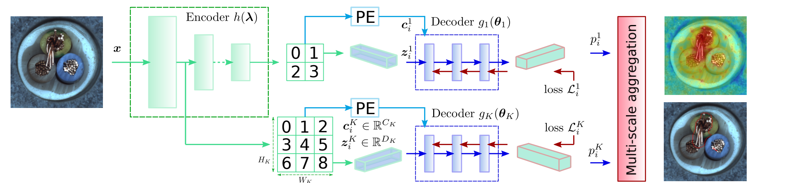
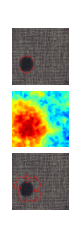
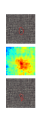
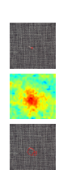
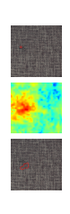
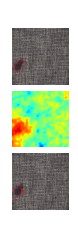
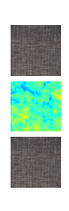
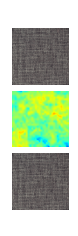
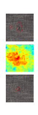

# Demystifying Unsupervised Anomaly Detection: A Review of Key Research Papers

### Source
[CFLOW-AD: Real-Time Unsupervised Anomaly Detection With Localization via Conditional Normalizing Flows](https://openaccess.thecvf.com/content/WACV2022/html/Gudovskiy_CFLOW-AD_Real-Time_Unsupervised_Anomaly_Detection_With_Localization_via_Conditional_Normalizing_WACV_2022_paper.html), WACV 2022

The pipeline of the CFLOW model is quite intuitive ; there is a standard feature extractor pre-trained on ImageNet dataset for generalization motives. The specificity is the extraction of the layers activation from the feature extractor at different scales thanks to pyramid pooling features. As illustrated in the methodology below, the activation of multi-scales pooling layers are passed to the counter part, many conditional decoders.  

The authors’ work can be presented as follows:

## Feature Extraction

The feature extraction part utilizes a multi-scale feature pyramid pooling approach. They define a CNN-based feature extractor, referred to as an encoder. This encoder transforms image patches into feature vectors which encode significant semantic details about the content of the patches. 

## likelihood estimation and Learning

Before we dive into the explanation, let's quickly review normalizing flow theory.

There are two primary motivations for using normalizing flow in likelihood-based generative models, which are often mutually exclusive in models like autoregressive models and variational autoencoders:

- **Feature Learning**: Variational autoencoders can learn feature representations but have intractable marginal likelihoods.
- **Tractable Likelihood**: Autoregressive models offer tractable likelihoods but lack a direct mechanism for learning features.

Normalizing flows aim to combine these benefits, enabling us to estimate the likelihood accurately while also improving feature learning.

### Theory

In normalizing flows, the goal is to transform simple distributions, which are easy to sample from and evaluate, into complex distributions learned from data.

The term **normalizing flow** can be understood as follows:

- **Normalizing** refers to obtaining a normalized density after applying an invertible transformation through the change of variables.
- **Flow** signifies that these invertible transformations can be sequentially composed to form more complex invertible transformations.

$$
x = f(z), x\in X, z \in Z 
$$

$$
\textnormal{Using change of variable to ensure the normalization of two distributions densities $X$ and $Z$: }
$$

$$
p_Xdx = p_Zdz \rightarrow p_X = p_Z\frac{dz}{dx} 
$$

$$
\textnormal{Now, the marginal likelihood $p(x)$ after an invertible tranfsormation $f^{-1}$ is given by:} 
$$

$$
p_{X}(x, \theta) = p_{Z}(f_\theta^{-1}(x)) |det(\frac{\partial f_\theta^{-1}(x)}{\partial x})|
$$

Intuitively, the above equation quantifies the deformation involved in transforming a simple distribution into a more complex one through the computation of the determinant of the jacobian an invertible transformation.

It is important to note that, unlike autoregressive models and variational autoencoders, deep normalizing flow models have specific architectural requirements:

- The input and output dimensions must be identical.
- The transformation must be invertible.
- The computation of the Jacobian determinant must be efficient and differentiable.

### Decoder

Each pooling layer activation is passed to an ecoder block, combined with a conditional vector using 2D of sinusoidal positional embedding. Like this we can allow to incorporate spatial prior to the model. For example, the model with such prior can learn how anomaly features should be arranged on the image. The decoder contains a sequence of conventional coupling layers with the additional conditional input (positional embedding).

## Reproduce CFLOW-AD results on **Carpet** class

Examples of the input images with ground truth anomaly masks (top row) for various classes of the MVTec. The CFLOW-AD model from estimates anomaly score maps (middle row) and generates segmentation masks (bottom row) for a threshold selected to maximize F1-score. The predicted segmentation mask should match the corresponding ground truth as close as possible.

       

