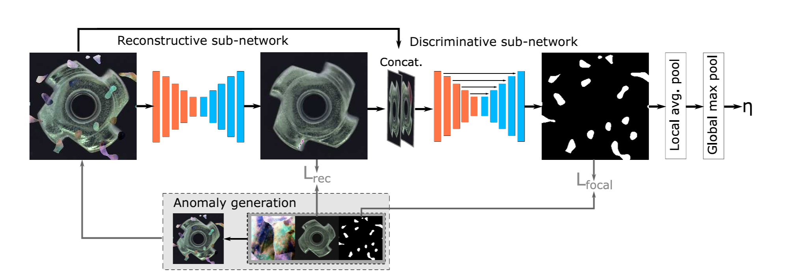
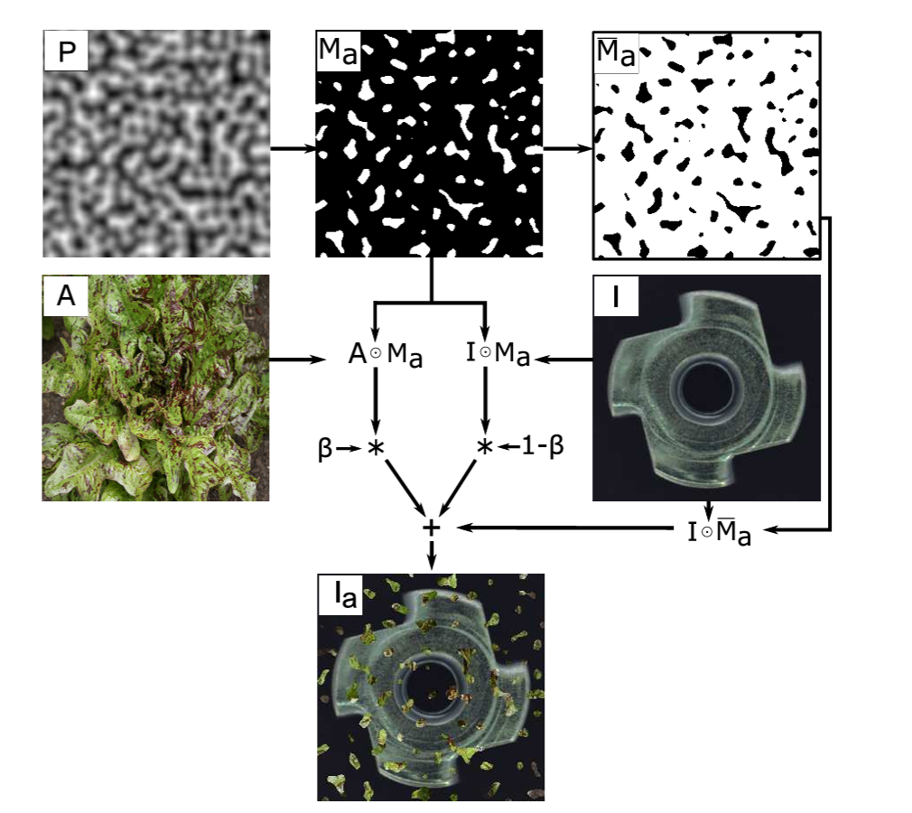
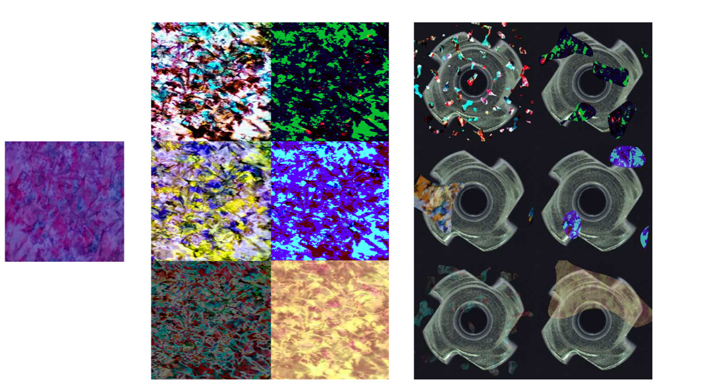

# Demystifying Unsupervised Anomaly Detection: A Review of Key Research Papers

### Source
[DRAEM - A Discriminatively Trained Reconstruction Embedding for Surface Anomaly Detection](https://openaccess.thecvf.com/content/ICCV2021/html/Zavrtanik_DRAEM_-_A_Discriminatively_Trained_Reconstruction_Embedding_for_Surface_Anomaly_ICCV_2021_paper.html), ICCV 2021

## DRÆM Pipeline

DRÆM consists of two sub-networks: a reconstructive sub-network and a discriminative sub-network. The reconstructive sub-network is trained to detect and reconstruct anomalies by generating anomaly-free content while preserving non-anomalous regions of the input image. Simultaneously, the discriminative sub-network learns to create accurate anomaly segmentation maps by combining the reconstructed and original images. Anomalous training examples are generated by simulating anomalies on anomaly-free images, providing an unlimited supply of pixel-perfect anomaly samples for training without needing real anomalous data.

## Reconstrutive Sub-Network

The reconstructive sub-network in the DRÆM method is designed as an encoder-decoder architecture. It transforms local patterns of the input image into patterns that resemble the distribution of normal samples. The network is trained to reconstruct the original image

from an artificially corrupted version which is created using a simulator. 

The reconstruction loss is :

$$
L_{reconst}(I, I_r) = \lambda L_{SSIM}(I, I_r) + l_2(I, I_r) 
$$

Where,

$$
\textnormal{$I, I_r$ : original and reconstructed images}
$$

$$
\textnormal{$\lambda$ : a loss balancing hyper-parameter}
$$

$$
\textnormal{$l_2 (I, I_r) = \frac{1}{N_p} \sum_{i=1}^{N_p}(I - I_r)_{(i,j)}$ }
$$

$$
\textnormal{$l_{SSIM} (I, I_r) = \frac{1}{N_p} \sum_{i=1}^{H} \sum_{j=1}^{W} 1 - SSIM(I - I_r)_{(i,j)}$ } 
$$

$$
\textnormal{$SSIM(I, I_r) = \frac{(2\mu_I\mu_{I_r} + c1)(2\sigma_{I,I_r} + c2)}{(\mu_I^2 + \mu_{I_r}^2 + c1)(\sigma_I^2 + \sigma_{I_r}^2 + c2)}$, Structural Similarity Index Measure}
$$

While an l2 loss is commonly used in reconstruction-based anomaly detection methods, it assumes independence between neighboring pixels. Therefore, a patch-based SSIM (Structural Similarity Index Measure) loss is also used, as seen above, to better capture the relationships between neighboring pixels. Note that the closer the SSIM value is to 1, the more similar the two images are. Conversely, a value closer to -1 indicates greater dissimilarity between the images.

## Discriminative Sub-Network

The discriminative sub-network uses a U-Net-like architecture. It takes as input $I_c$, which is the channel-wise concatenation of the output from the reconstructive sub-network $I_r $ and the original input image $I$.

The reconstructive sub-network's normality-restoring property ensures that $I_r$ and $I$ differ significantly in anomalous regions, aiding in anomaly segmentation. Unlike traditional reconstruction-based methods that rely on predefined similarity functions like $SSIM$, the discriminative sub-network learns the appropriate distance measure automatically. It outputs an anomaly score map $M_o$ that matches the size of $I$. To enhance segmentation accuracy, especially for difficult examples, Focal Loss is applied to the output of the discriminative sub-network.

## Simulated anomaly generation

...

