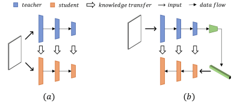
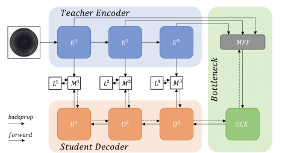
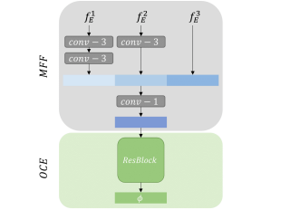

# Demystifying Unsupervised Anomaly Detection: A Review of Key Research Papers

### Source
[Anomaly Detection via Reverse Distillation From One-Class Embedding](https://openaccess.thecvf.com/content/CVPR2022/html/Deng_Anomaly_Detection_via_Reverse_Distillation_From_One-Class_Embedding_CVPR_2022_paper.html), CVPR 2022

## **What’s Knowledge Distillation (KD) ?**

Knowledge distillation endorse a simpler model (student) which is trained to mimic the behavior of a larger, more complex (not necessarily but mostly pre-trained) model (teacher). The objective is to transfer the knowledge from the teacher model to the student model, enabling the student model to achieve similar performance.

Teacher-student methods involve selecting specific layers from a pre-trained backbone network, such as ResNet, VGG, or EfficientNet, and using them as a fixed-parameter teacher. During training, the teacher model guides the student model in learning the features of normal samples by extracting and representing these characteristics. During inference, the features extracted from normal samples by both the teacher and student models are comparable, while the features extracted from anomalous samples differ.

By comparing the feature maps generated by both networks, these methods can create score maps to determine whether an image is anomalous, even at the pixel level for anomaly localization. Variations in these methods include using multiple student networks, different teacher-student configurations, leveraging both final and internal features to generate the maps, and employing various calculations to define the anomaly score.

## Conventional KD

In this teacher-student (T-S) paradigm, both the teacher and student models share essentially the same architecture and both process the raw image as input. The student's task is to align its extracted features with those of the teacher. Both networks function as encoder-based models, embedding the image into low-dimensional features (a).

## Reverse KD

Personally, I don’t believe “Reverse” is the optimal term to describe this type of distillation.

In the reverse knowledge distillation (KD) paradigm, different architectures are used for the teacher and student models. Generally, the teacher model acts as an encoder, while the student model decodes the embedded raw image (the encoder's output) and attempts to mimic the teacher's task by generating features. The key idea is that decoding these embeddings will produce varying representations. Consequently, low similarity in these anomalous representations indicates a high abnormality score.

The term "reverse" stems from the fact that the student network has an architecture opposite to that of the teacher. This encoder-decoder approach differs from generative models in two main ways: first, the teacher and student are trained separately, with the teacher being frozen during distillation; second, instead of using pixel-level reconstruction error, it detects anomalies in the semantic feature space.

## One-Class Bottleneck Embedding

The primary link between the teacher and student in reverse KD is the OCBE module (One-Class Bottleneck Embedding) (in the figure below). 

The rich features extracted from the teacher model are often highly redundant, which can hinder the student model when decoding essential anomaly-free features. To address this issue, an OCBE module is introduced to project the teacher’s high-dimensional representations into lower-dimensional ones, preventing the propagation of unusual fluctuations to the student model.

The OCBE module mainly comprises two sub-modules:

- **MFFB**: Concatenates multi-scale representations before projection, achieved through downsampling via convolution layers followed by batch normalization and ReLU activation.
- **OCEB**: Retains the most essential information for the student model to decode.

