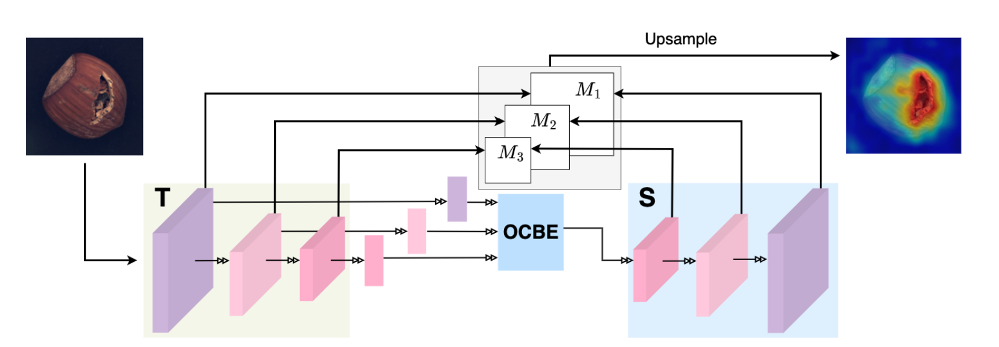
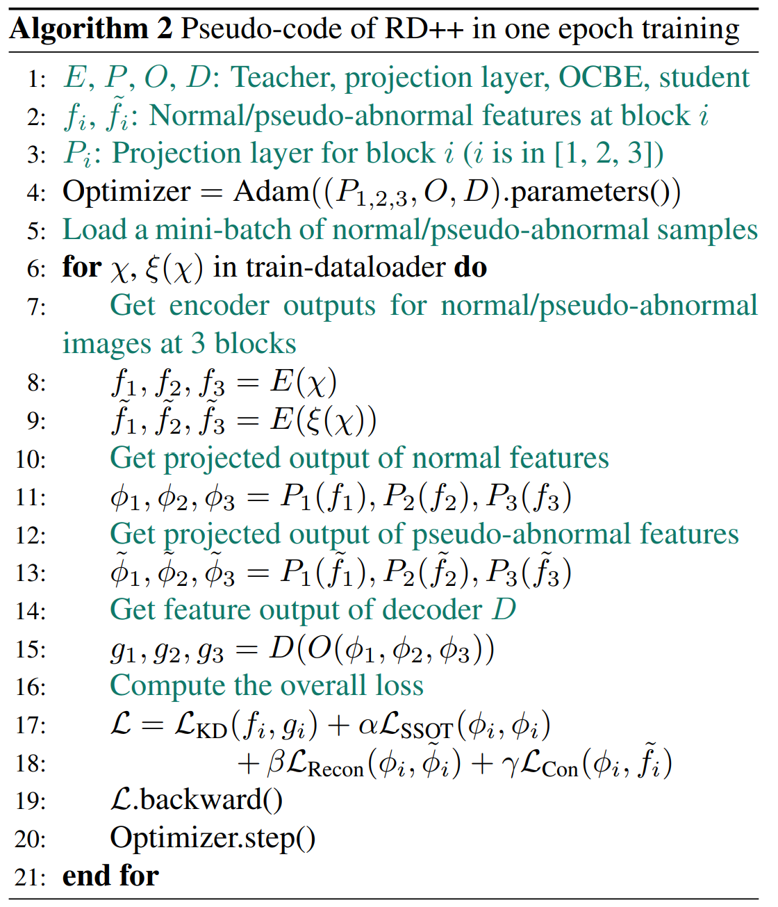

# Demystifying Unsupervised Anomaly Detection: A Review of Key Research Papers

### Source
[Revisiting Reverse Distillation for Anomaly Detection](https://openaccess.thecvf.com/content/CVPR2023/html/Tien_Revisiting_Reverse_Distillation_for_Anomaly_Detection_CVPR_2023_paper.html), CVPR 2023

## Reverse Distillation Limitation

The main premise of reverse distillation is that anomalous features are not transmitted to the student during training via the OCBE module. However, there is no guarantee against this potential leakage. Therefore, the RD revisiting paper addresses this issue with a training objective designed to control the flow of abnormal features.

## Control the leakage of anomalous features to the student model

### Linear Projection

Linear layers were added after each teacher block and then passed to the OCBE module (as described in the RD blog) to ensure representation compactness with the student model. Linear projections will tend to capture linear features while missing nonlinearities, including anomalous features.

Adding more linear layers won't increase the model's latency due to their lightweight nature.

### Training Objectives

$$
L = L_{KD} + \alpha L_{SSOT} + \beta L_{Recon} + \gamma L_{Con} 
$$

- The second component is used for **the self-supervised optimal transport loss** and ensures the learning of compact feature representations between normal images:
    - The optimal transport loss aims to make the projected embeddings after the projection layers close to each other. To achieve this, the authors utilized the **de-biased Sinkhorn divergence, a variant of the Optimal Transport Distance.** This distance measure allows the calculation of the spatial discrepancy between two distributions of feature spaces (normal images).

$$
L_{SSOT} = \frac{1}{m} \frac{1}{K} \sum_{i,j = 1}^{m} \sum_{k = 1}^{K} S_{\epsilon, \rho} (\sigma (\phi_{k}(f_{i,k}), \sigma (\phi_{k}(f_{j,k})) \\[0.5cm] 

\textnormal{
$S_{\epsilon, \rho}(\alpha, \beta)$ : de-biased Sinkhorn divergence between two empirical
measures $\alpha$ and $\beta$} \\

\textnormal{$f_{i,k}$ : the feature output of training sample at index i from the $k^{th}$ block of teacher’s encoder} \\

\textnormal{$\phi_{k}$ : be
the projection layer at block k
th of teacher’s encoder output} \\
\textnormal{$\sigma$ : be
softmax function} \\
\textnormal{$\pi$ : be the transportation plan} \\
\textnormal{C  : denotes some ground cost to transport a unit of mass between
probability distributions $\alpha$ and $\beta$ }

$$

- The third component involves reconstruction, where normal images are recovered from simplex noisy images (pseudo-anomalous images) during training :
    $$
    L_{Recon} = \frac{1}{K} \sum_{k=1}^{K} (1 - \cos(\phi_{k}(f_{i, k}), \phi_{k}(\tilde{f}_{i, k}))) \\[0.5cm]
    
    \textnormal{$f_{i,k}$ = $E^k(x_i)$, the feature output of the $k^{th}$ block of the encoder $E$ given a normal image $x_i$} \\
    
    \textnormal{$\tilde{f}_{i,k}$ = $E^k(\xi(x_i))$, the feature output of the $k^{th}$ block of the encoder $E$ given a pseudo-abnormal image $\xi(x_i)$}
    $$
    
    

- The last component involves contrast loss to strengthen the compact learning of projection layers on normal images. This is achieved by forcing the projection layer to focus on exploring deeper representations of normal features while pushing away abnormal information from the projected normal space.
    
    $$
    L_{Con} = \frac{1}{K} \sum_{k=1}^{K} \max(0, \cos(\phi_{k}(f_{i,k}), \tilde{f}_{i,k}) - f)
    $$
    

    
Here's an overview of training one epoch of the entire chain:

    
