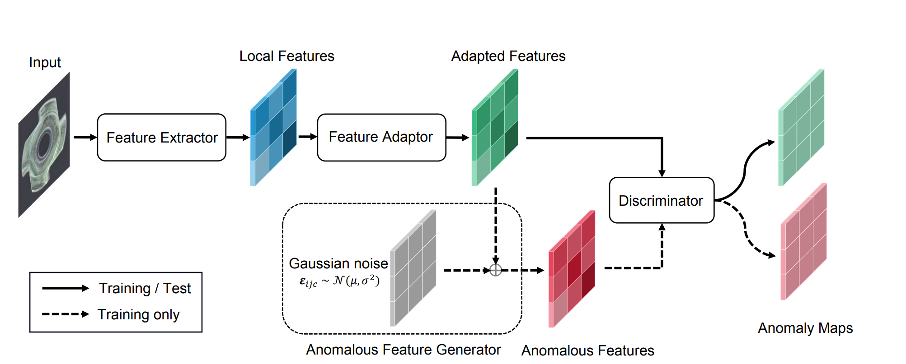
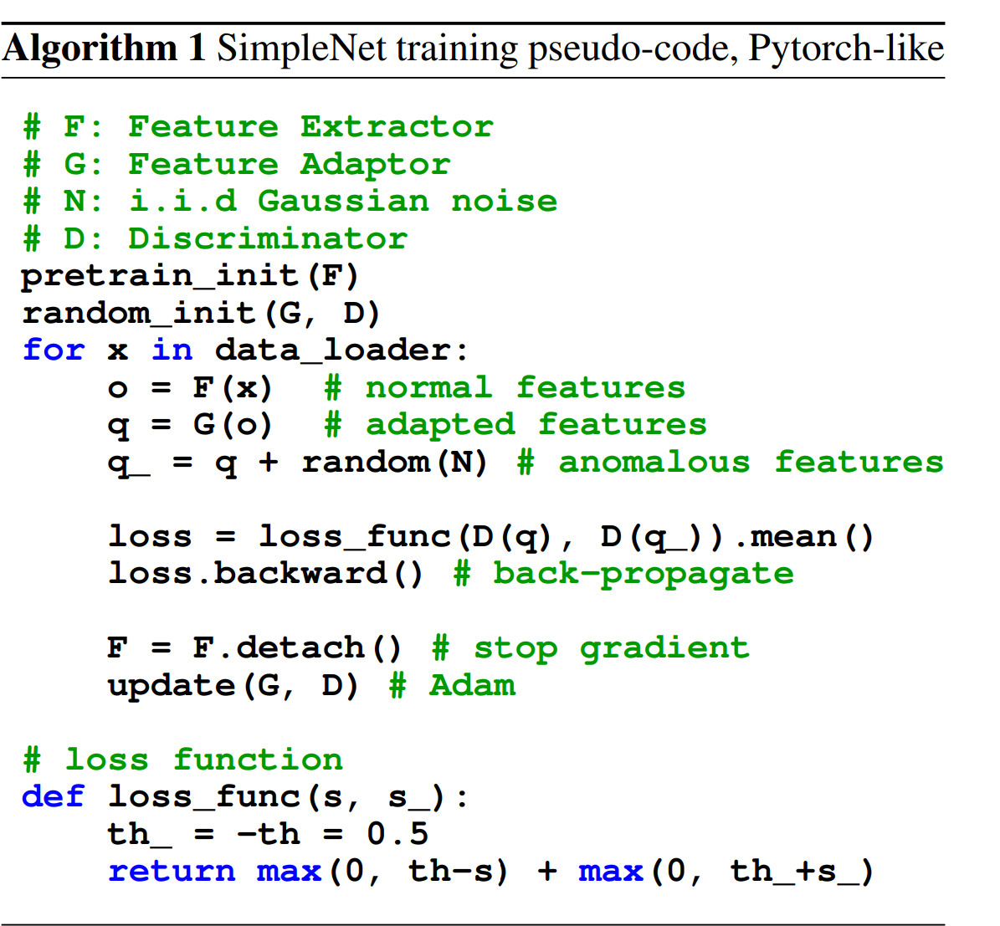

# Demystifying Unsupervised Anomaly Detection: A Review of Key Research Papers

### Source
[SimpleNet: A Simple Network for Image Anomaly Detection and Localization](https://openaccess.thecvf.com/content/CVPR2023/html/Liu_SimpleNet_A_Simple_Network_for_Image_Anomaly_Detection_and_Localization_CVPR_2023_paper.html), CVPR 2023

## Motivation

## Methodology

### Feature Extractor

$$
\textnormal{A backbone $\phi$ (eg. a resnet)
extracts output feature maps from different levels $l \in L$}
$$

$$
\textnormal{The ouput feature from level $l$ given an input sample $x_i$, denoted by $\phi^{i,l}$, will be aggregating with its neighbors as follows:}
$$

$$
\textnormal{$z_{h,w}^{l,i} = f_{agg}(\{ \phi_{h', w'}^{l, i}  | (h', w') \in \mathcal{N_{p}^{h,w}} \}) $}
$$

$$
\textnormal{Where}
$$

$$
\textnormal{$\mathcal{N_{p}^{h,w}}$ is the neighborhood of $\phi_{h', w'}^{l, i}$ with patch size $p$ at location $(h, w)$} 
$$

$$
\textnormal{$f_{agg}$ is the adaptive average pooling layer}
$$

$$
\textnormal{Then, in order to combine all features $\phi_{h', w'}^{l, i}$ from diffenets levels $l \in L$, a rescaling to the $(h_0, w_0)$ shape is done properly:}
$$

$$
\textnormal{$o^i = f_{cat}(resize(z^{i,l}, (h_0, w_0)) | l \in L)$}
$$

$$
\textnormal{Hence, our feature extractor $F_\phi(x^i) = o^i$ where} $$

$$
\textnormal{$F = f_{cat} \circ resize \circ f_{agg}$}
$$

### Feature Adaptor

Knowing that real application data distribution are quite different from those of dataset on which the feature extractor was pre-trained, the authors propose a feature adaptor to transfer training features to the target domain.  

$$
\textnormal{The feature adaptor $\it{G}_\theta$ is made of fully-connected layers:}
$$

$$
\textnormal{$q_{h,w}^i$ = $\it{G}_{\theta}$ $(o_{h,w}^i)$}
$$

### Anomalous Feature Generator

### Discriminator

Here's an overview of training one epoch of the entire chain:

