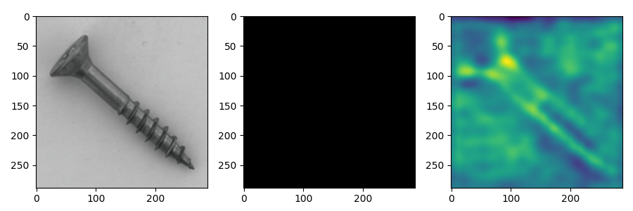
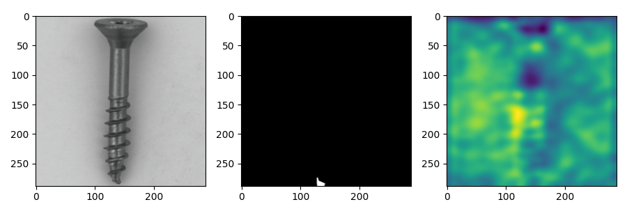
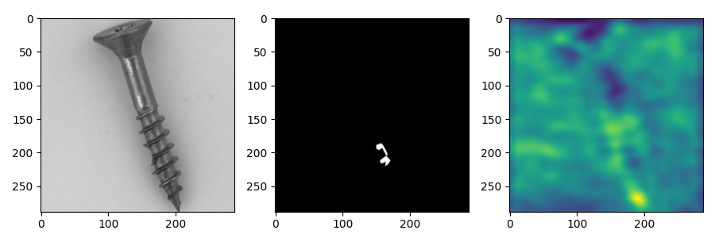
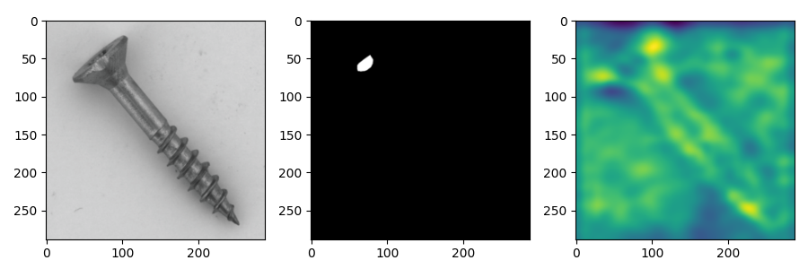
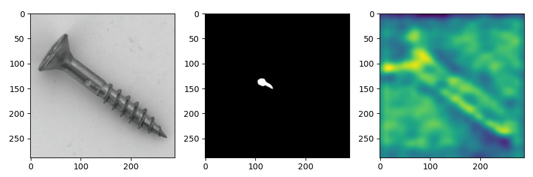
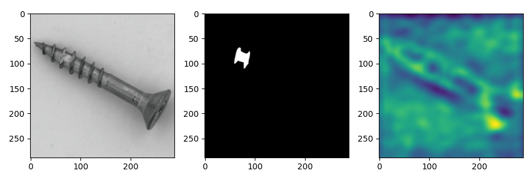

# Demystifying Unsupervised Anomaly Detection: A Review of Key Research Papers

### Source
[SimpleNet: A Simple Network for Image Anomaly Detection and Localization](https://openaccess.thecvf.com/content/CVPR2023/html/Liu_SimpleNet_A_Simple_Network_for_Image_Anomaly_Detection_and_Localization_CVPR_2023_paper.html), CVPR 2023

## Motivation
Unlike traditional knowledge distillation methods that utilize a Teacher-Student model, requiring both architectures to process the input image simultaneously, which doubles execution complexity and increases latency, SimpleNet takes a different approach. Instead of relying on pre-trained model-based methods, SimpleNet addresses the bias inherent in pre-trained configurations (mainly due to the pre-training dataset) by introducing a feature adaptor. This feature adaptor enables transfer learning on the target dataset, which is the key feature of this state-of-the-art method.

## Methodology
During the training phase, nominal samples are input into a pre-trained Feature Extractor to obtain local features. A Feature Adaptor then adjusts these pre-trained features to fit the target domain. Anomalous features are generated by adding Gaussian noise to these adapted features. The adapted features serve as positive samples, while the anomalous features act as negative samples for training the final Discriminator. During inference, the Anomalous Feature Generator is not used.

### Feature Extractor

$$
\textnormal{A backbone $\phi$ (eg. a resnet)
extracts output feature maps from different levels $l \in L$}
$$

$$
\textnormal{The ouput feature from level $l$ given an input sample $x_i$, denoted by $\phi^{i,l}$, will be aggregating with its neighbors as follows:}
$$

$$
\textnormal{$z_{h,w}^{l,i} = f_{agg}(\{ \phi_{h', w'}^{l, i}  | (h', w') \in \mathcal{N_{p}^{h,w}} \}) $}
$$

$$
\textnormal{Where}
$$

$$
\textnormal{$\mathcal{N_{p}^{h,w}}$ is the neighborhood of $\phi_{h', w'}^{l, i}$ with patch size $p$ at location $(h, w)$} 
$$

$$
\textnormal{$f_{agg}$ is the adaptive average pooling layer}
$$

$$
\textnormal{Then, in order to combine all features $\phi_{h', w'}^{l, i}$ from diffenets levels $l \in L$, a rescaling to the $(h_0, w_0)$ shape is done properly:}
$$

$$
\textnormal{$o^i = f_{cat}(resize(z^{i,l}, (h_0, w_0)) | l \in L)$}
$$

$$
\textnormal{Hence, our feature extractor $F_\phi(x^i) = o^i$ where} $$

$$
\textnormal{$F = f_{cat} \circ resize \circ f_{agg}$}
$$

### Feature Adaptor

Knowing that real application data distribution are quite different from those of dataset on which the feature extractor was pre-trained, the authors propose a feature adaptor to transfer training features to the target domain.  

$$
\textnormal{The feature adaptor $\it{G}_\theta$ which is made of fully-connected layers, takes the output of the feature extractor.}
$$ 

### Anomalous Feature Generator
To train the Discriminator to estimate the likelihood of samples being normal, the authors optimize it using both normal samples and negative samples (defect features). Due to the scarcity of defect features, they add gaussian noise to normal samples in the feature space to create the negative samples.

$$
q_{h,w}^{i-} =  q_{h,w}^{i} + \mathcal{N}(\mu, \sigma^2)
$$

Where 

$$
\textnormal{$q_{h,w}^{i}$ is the output of $\it{G}_\theta$}
$$

### Discriminator

The Discriminator functions as a normality scorer, directly estimating normality at each location (h, w). During training, both normal features and generated negative samples are fed to the Discriminator. It produces positive outputs for normal features and negative outputs for anomalous features. A simple 2-layer multi-layer perceptron (MLP) structure is used for this task.

Here's an overview of the entire chain:

## Reproduce  results on **Screw** class

Qualitative results, where sampled image, ground truth, and anomaly map are shown for **cscrew** class in MVTec dataset.

 

 

